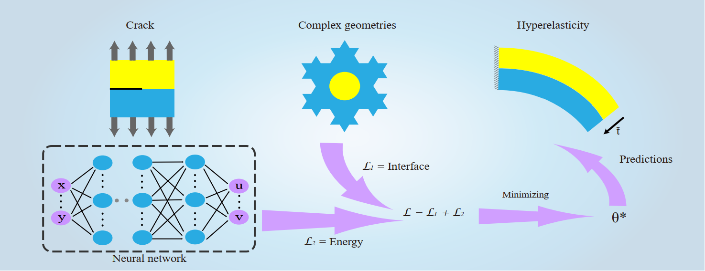

# Research-on-Solving-Partial-Differential-Equations-of-Solid-Mechanics-Based-on-Physics-Informed-Neural Network

This is the part code of my master thesis, including Data-driven, DEM (Deep Energy Method), and CENN (Deep Energy method with subdomains).

The detail is:
1.Data-driven: familiar to the AD(Automatic Differientiation) in Pytorch
2.DEM:Deep Learning Method with the application to the benchmark of the solid mechanics.
3.CENN:Conservative energy method based on neural networks with subdomains (paper:https://arxiv.org/abs/2110.01359 submitted to CMAME, in major revision) 

@author: yizheng wang (王一铮), 447650327@qq.com or wang-yz19@mails.tsinghua.edu.cn 

the code is revised from https://github.com/MinhNguyenIKM/dem_hyperelasticity

I will keep updating it, if you find any problem, please contact me without any hesitation by email. Thank you !

IF it is helpful, please star me !

In future, I will expand PINN in solid mechanics. If you have any idea, we can do it together for great job!

