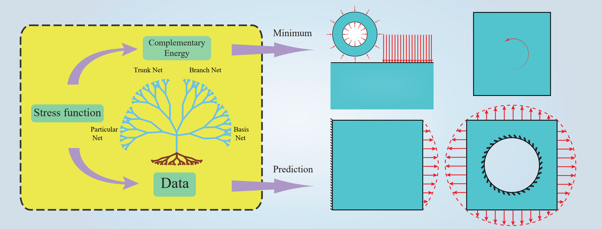
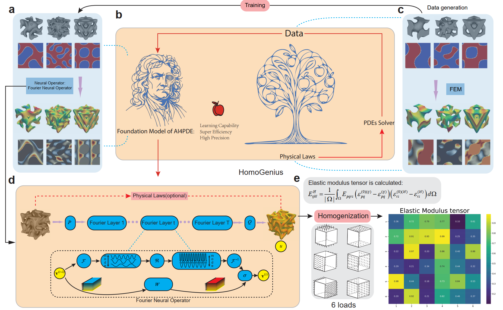

# Research-on-Solving-Partial-Differential-Equations-of-Solid-Mechanics-Based-on-Physics-Informed-Neural Network

This is the part code of my master thesis, including Data-driven, DEM (Deep Energy Method), CENN (Deep Energy method with subdomains), and DCEM (using complementary energy instead of potential energy).

The detail is:

1.Data-driven: familiar to the AD(Automatic Differientiation) in Pytorch

2.DEM:Deep Learning Method with the application to the benchmark of the solid mechanics. (The code is revised from https://github.com/MinhNguyenIKM/dem_hyperelasticity)

3.CENN:Conservative energy method based on neural networks with subdomains (paper:
[10.1016/j.cma.2022.115491](https://www.sciencedirect.com/science/article/pii/S0045782522005096?via%3Dihub#da1) submitted to CMAME, accept) 

4.DCEM: DCEM: A deep complementary energy method for solid mechanics (paper:
[IJNME](https://onlinelibrary.wiley.com/doi/full/10.1002/nme.7585)) 

Recently, I am doing the neural operator with computational mechanics, there are some interesting works:

1. HomoGenius: using neural operator to accelerate the prediction of the effective modulus in homogenization process. (paper: submitted to [Nature machine intelligence](https://www.researchsquare.com/article/rs-3994416/v1)

@author: yizheng wang (王一铮), 447650327@qq.com or wang-yz19@mails.tsinghua.edu.cn, wechat: 17326912090

I will keep updating it, if you find any problem, please contact me without any hesitation by email. Thank you !

If it is helpful, please star me !

In future, I will expand PINN in solid mechanics. If you have any idea, we can do it together for great job!