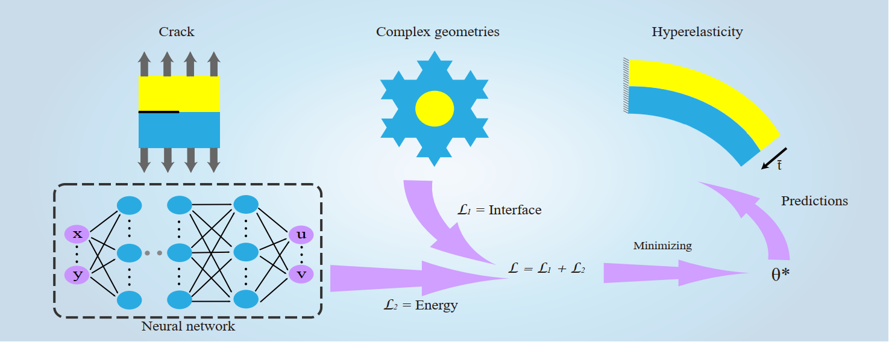
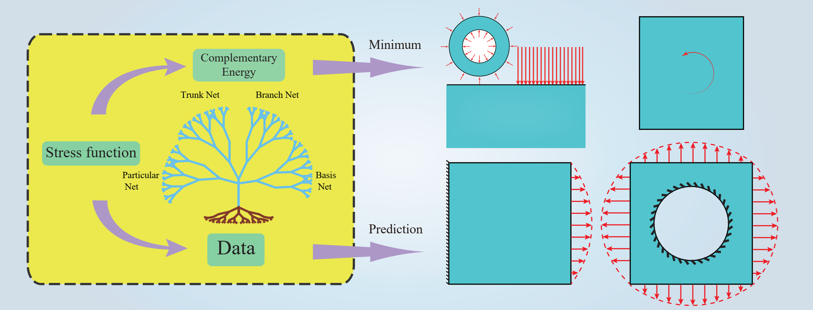
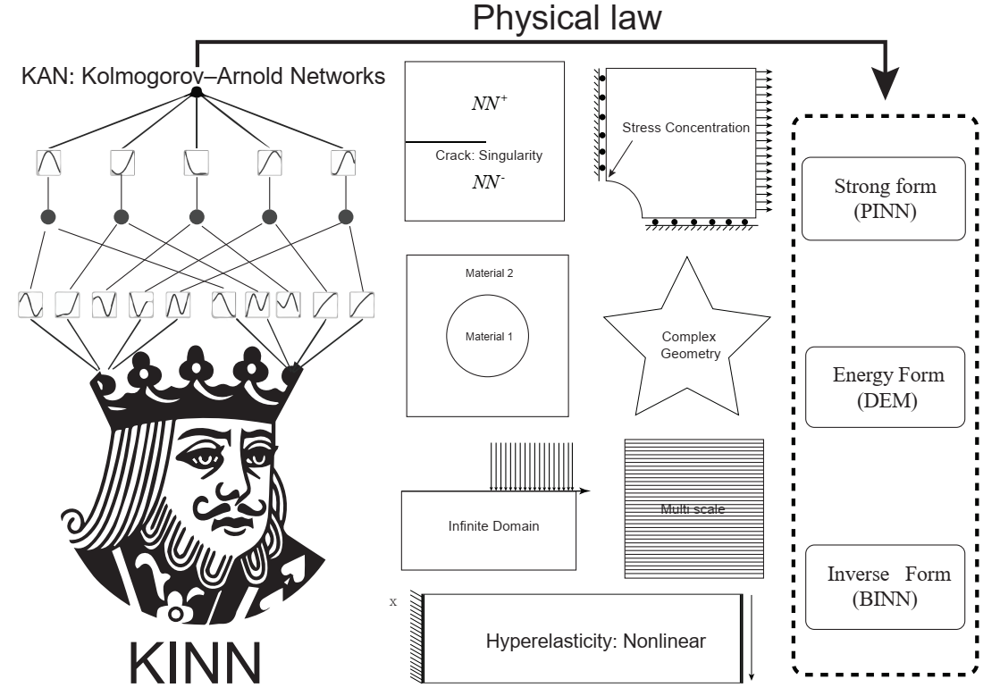
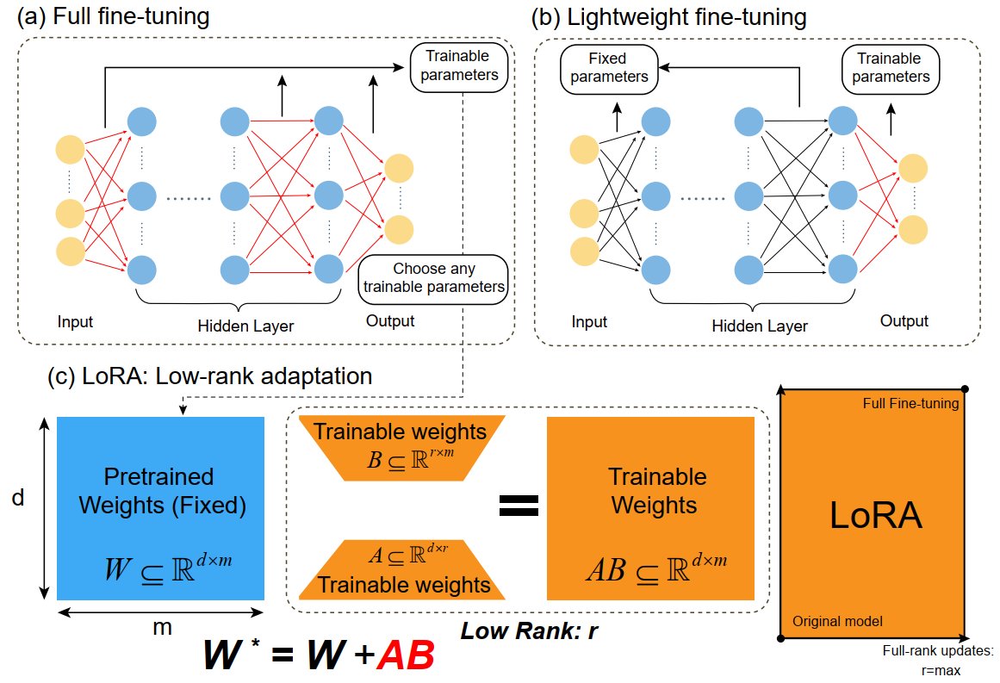

# Research on Solving Partial Differential Equations of Solid Mechanics Based on Physics-Informed Neural Networks

This repository contains part of the code from my master thesis, covering **Data-driven**, **DEM (Deep Energy Method)**, **CENN**, **DCEM**, **KINN**, as well as recent work on **Transfer Learning for PINNs**.

---

## Overview of Methods

### 1. Data-driven
Data-driven solving via PyTorch automatic differentiation (AD).

### 2. DEM (Deep Energy Method)
Deep energy method based on the potential energy principle, applied to solid mechanics benchmarks.  
Code is adapted from [dem_hyperelasticity](https://github.com/MinhNguyenIKM/dem_hyperelasticity).

### 3. CENN (Conservative Energy Neural Networks)
Neural network approach based on conservative energy with subdomains.  
- Paper: [*CMAME*](https://www.sciencedirect.com/science/article/pii/S0045782522005096?via%3Dihub#da1) (2022), doi: 10.1016/j.cma.2022.115491  

### 4. DCEM (Deep Complementary Energy Method)
Deep complementary energy method based on the complementary energy principle.  
- Paper: [*IJNME*](https://onlinelibrary.wiley.com/doi/full/10.1002/nme.7585)  

### 5. KINN (KAN-based Physics-Informed Neural Networks)
Physics-informed neural networks based on KAN for forward and inverse problems in solid mechanics.  
- Paper: [*CMAME*](https://www.sciencedirect.com/science/article/abs/pii/S0045782524007722)  

---

## Recent Work: Transfer Learning for PINNs

Applications of transfer learning to PINNs, including:

- **Taylor–Green vortex**: strong-form PINNs with LoRA fine-tuning, KINN full fine-tuning, etc.;
- **Plate with hole**: geometry/parameter transfer (e.g. ellipse → circle) and error evolution;
- **DEM beam**: neural operators (e.g. FNO) and data-driven beam problems.

-Paper: [*IJMSD*](https://onlinelibrary.wiley.com/doi/full/10.1002/msd2.70030)

---

## Repository Structure

| Directory | Description |
|-----------|-------------|
| `data-driven/` | Data-driven (AD) code |
| `DEM/` | Deep Energy Method |
| `CENN/` | Conservative energy with subdomains (crack, Koch, etc.) |
| `DCEM/` | Deep Complementary Energy Method |
| `KINN/` | KAN-based networks; plate hole, crack, non-homogeneous, high-frequency examples |
| `Transfer_learning_PINNs/` | Transfer learning (Taylor–Green, Plate_hole, DEM_beam, etc.) |

---

## Author & Contact

**Author**: Yizheng Wang (王一铮)  
Personal website: https://yizheng-wang.github.io/
- Email: 447650327@qq.com or wang-yz19@tsinghua.org.cn
- WeChat: 17326912090  

I will keep updating the code and documentation. If you find any issues, please feel free to contact me by email. If this repository is helpful, a Star is appreciated.  

I plan to continue extending PINN-related research in solid mechanics. Collaboration ideas are welcome.
